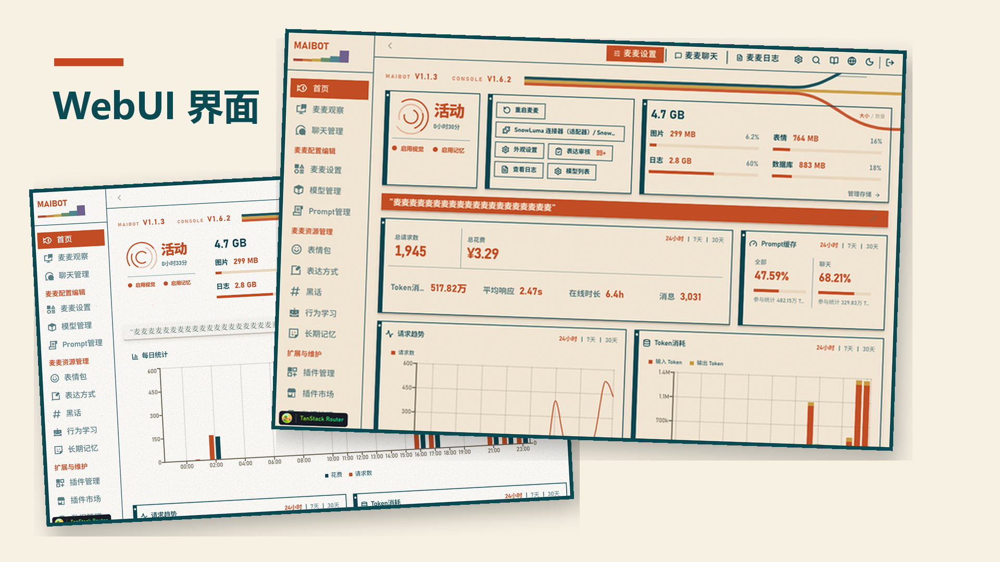
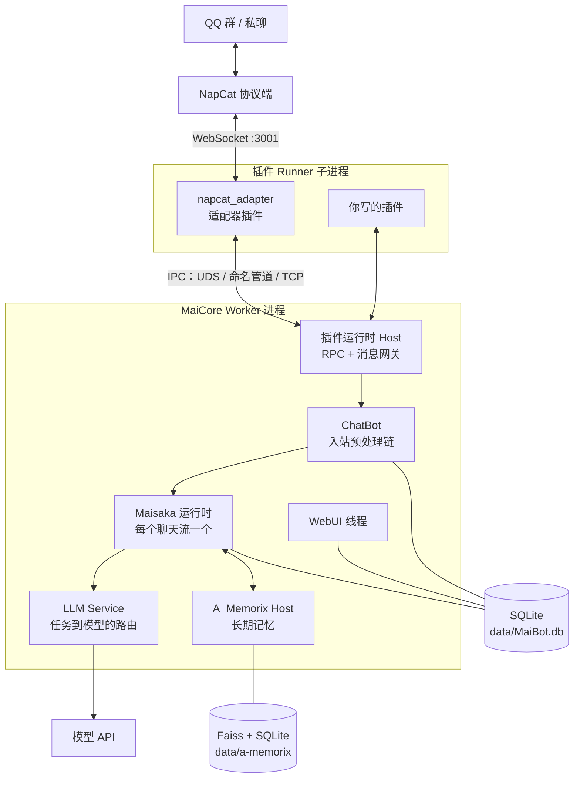
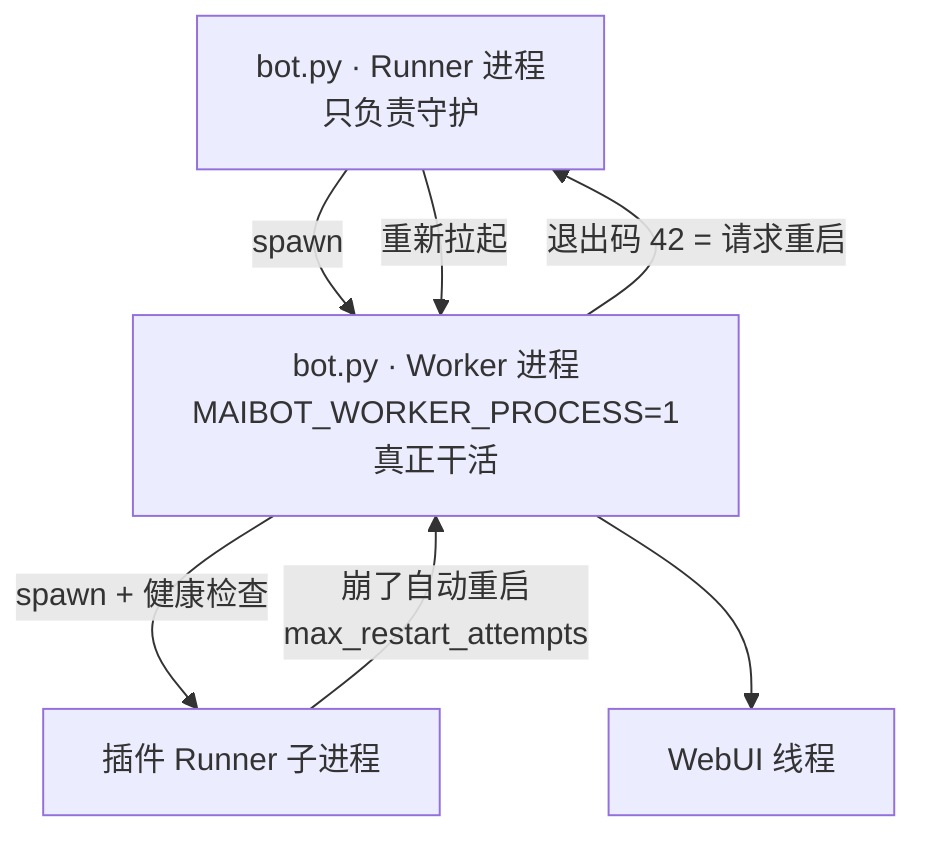
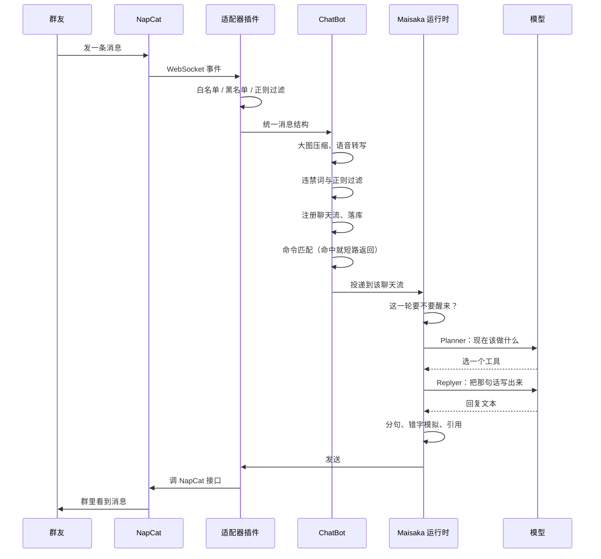
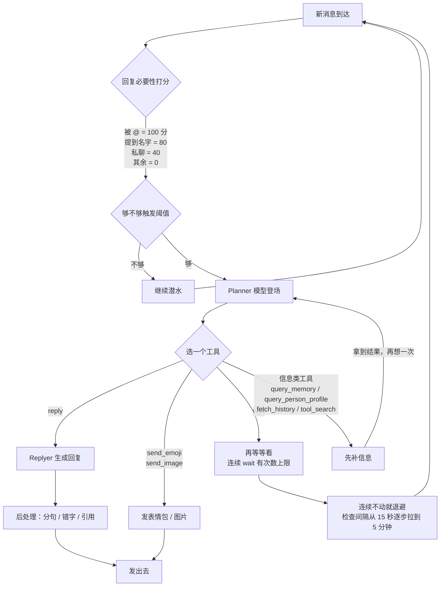
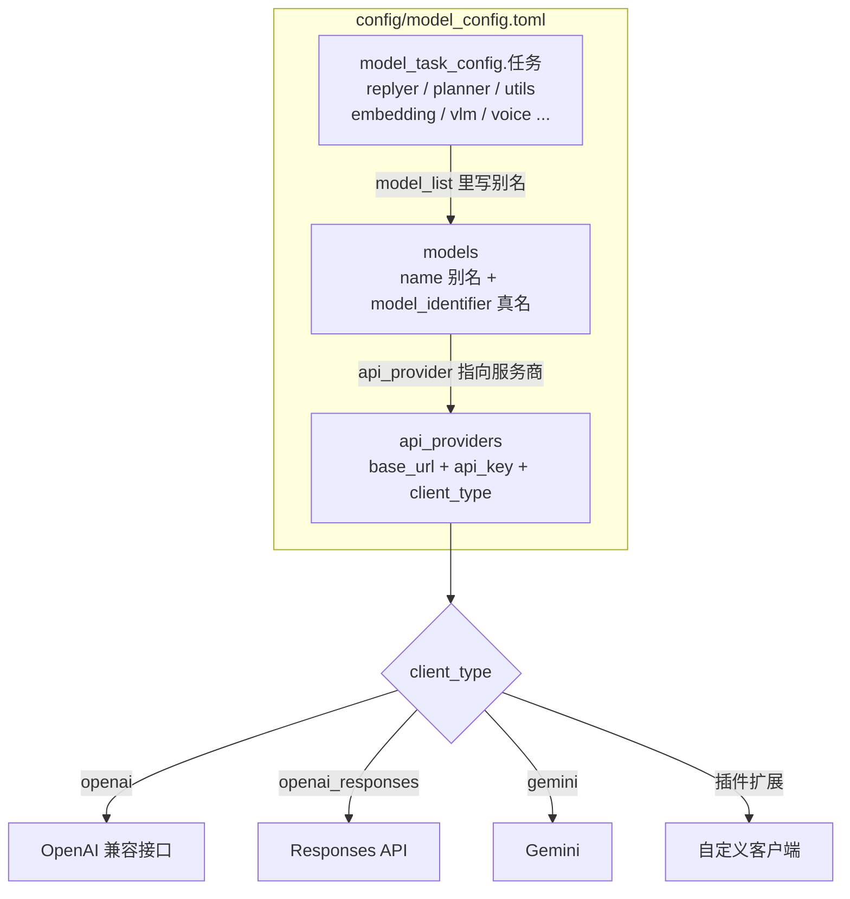
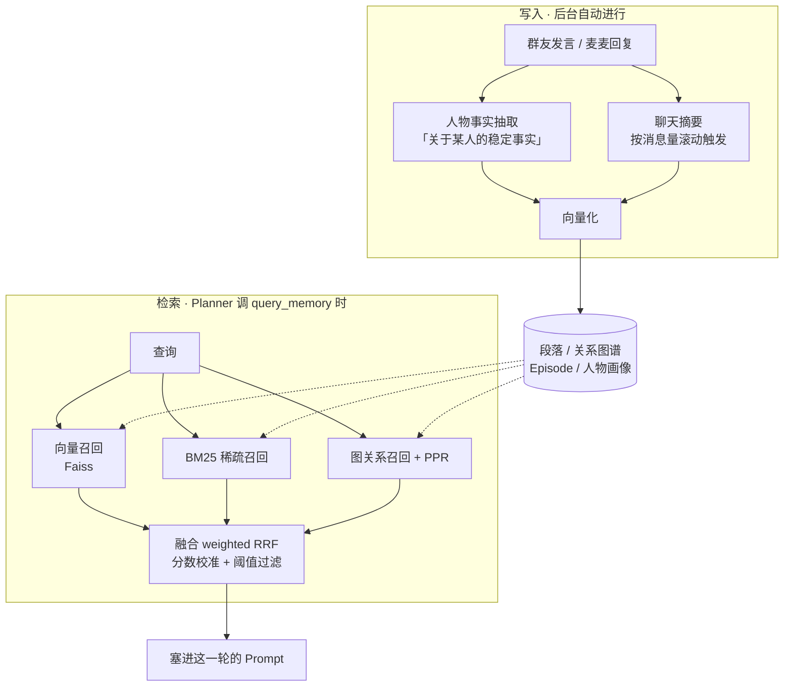
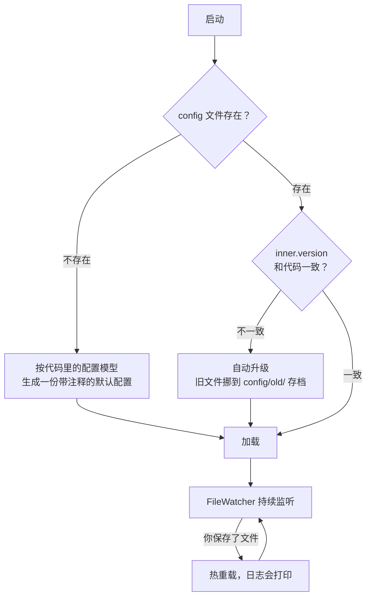
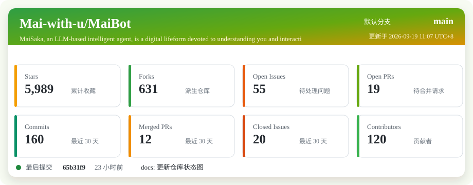
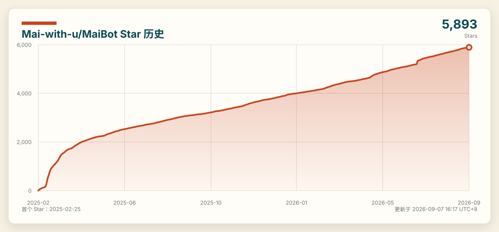

<a id="-双语--bilingual"></a>

<div align="center">

  <!-- Language Switcher -->
  <a href="#-双语--bilingual">双语 / Bilingual</a> | <a href="docs/README_CN.md">中文</a> | <a href="docs/README_EN.md">English</a>

  <br>

  <h1>麦麦 MaiBot</h1>

  <p>「不是一个有求必应的助手，是一个会读空气的群友」</p>

  <!-- Badges Row -->
  <p>
    
    
    
    
    
    <br>
    <a href="https://trendshift.io/repositories/20445" target="_blank"></a>
  </p>
</div>

<br>

<!-- Mascot on the Right (Float) -->


一个基于大语言模型的可交互智能体。她待在你的群里，自己决定什么时候开口、什么时候闭嘴，会模仿群友的说话方式，会记住你是谁。

麦麦不仅仅是一个机器人，不仅仅是一个可以帮你完成任务的「有帮助的助手」，她还是一个致力于了解你，并以真实人类的风格进行交互的数字生命。她不追求完美，不追求高效，但追求亲切和真实。

- 💭 **没有人喜欢 GPT 的语言风格**：麦麦使用了更加自然、贴合人类对话习惯的交互方式，不是长篇大论或者 markdown 格式的分点，而是或长或短的闲谈。
- 🎭 **不再是傻乎乎的一问一答**：懂得在合适的时间说话，把握聊天中的气氛，在合适的时候开口，在合适的时候闭嘴。
- 🧠 **麦麦·成为人类**：在多人对话中，麦麦会模仿其他人的说话风格，还会自主理解新词或者小圈子里的黑话，不断进化。
- ❤️ **永远都在更加了解你**：基于心理学中人格理论，麦麦会不断积累对于你的了解，不论是你的信息、喜恶或是行为风格，她都记在心里。
- 🔌 **插件系统**：提供强大的 API 和事件系统，拥有无限扩展可能。

<br clear="all">

<div align="center">
  
</div>

<br>

| 你想要的 | 要动的地方 | 最终得到什么 |
| :--- | :--- | :--- |
| 先跑起来看看效果 | 模型配置 + 终端对话模式 | 不用装 QQ，直接在终端跟她聊 |
| 让她待在我的 QQ 群 | NapCat + 适配器插件白名单 | 群里 @ 一下就有反应 |
| 让她别话痨 / 别太安静 | `talk_value` + 退避参数 | 频率可控到「一小时冒一句」 |
| 让她记住群友 | `a_memorix` + embedding 模型 | 人物画像、长期记忆、跨天回忆 |
| 让她说话像我们群的人 | 表达学习 + 黑话学习 | 自动学群内梗和语气 |
| 加自己的功能 | 插件 SDK | 自己的命令、动作、适配器 |

🚀 [零基础跑起来](#-零基础-10-分钟跑起来) · 🏗️ [服务架构](#️-服务架构) · 🔁 [一条消息的旅程](#-一条消息的旅程) · 🧠 [她怎么决定说不说](#-她怎么决定说不说) · 🎛️ [模型路由](#️-模型是怎么路由的) · 🧵 [长期记忆](#-长期记忆是怎么工作的) · ⚙️ [配置生命周期](#️-配置的生命周期) · 📦 [安装](#-三种安装方式) · 🔧 [给开发者](#-给开发者) · 📚 [文档与演示](#-文档与演示) · 💬 [社区](#-讨论与社区)

---

## 🚀 零基础 10 分钟跑起来

不会命令行也没关系。你只需要准备**一个模型 API Key**，其余照抄。

### 第一步：装环境

```bash
git clone https://github.com/Mai-with-u/MaiBot.git && cd MaiBot
```

```bash
uv sync
```

`main` 是稳定版，`dev` 是开发版。第一次用请选 `main`。

### 第二步：先启动一次，让它把配置生成出来

```bash
uv run python bot.py
```

这一次启动会做三件事：让你输入 `同意` 确认协议、生成 `config/` 下的两个配置文件、建好数据库。看到日志刷起来就 `Ctrl+C` 停掉。

### 第三步：填模型，然后在终端里直接跟她聊

打开 `config/model_config.toml`，三段按顺序填：

| 填哪一段 | 填什么 |
| :--- | :--- |
| `[[api_providers]]` | 服务商：`base_url`、`api_key`、`client_type` |
| `[[models]]` | 具体模型：`model_identifier`（真实模型名）+ `name`（你起的别名） |
| `[model_task_config.*]` | 把别名填进任务的 `model_list` |

**四个任务必须填**：`replyer`（说话）、`planner`（决定说不说）、`utils`（杂活）、`embedding`（记忆，**必须是 embedding 模型，不能填 LLM**）。

然后把 `config/bot_config.toml` 里的 `[debug] enable_console_input` 改成 `true`，重新启动：

```bash
uv run python bot.py
```

现在可以直接在终端里跟她说话了。**这一步完全不需要 QQ**，是验证「模型配得对不对」最快的办法。

> 想接 QQ？装好 NapCat，在它里面开一个 WebSocket 服务器（默认 3001），然后在 `plugins/napcat_adapter/config.toml` 填上地址，**并把你的群号加进 `group_list`**——默认是白名单模式，不加群号等于全部屏蔽。这是新手「她怎么没反应」的头号原因。

---

## 🏗️ 服务架构

### 整体是这样连起来的



三个容易误解的点：

- **适配器不是独立程序。** 它现在是插件，跑在插件 Runner 子进程里，通过 IPC 跟主进程说话。你不用再单独起一个适配器。
- **WebUI 是主进程里的一个线程**，不是另一个服务，所以它能直接读到运行时状态。
- **有两套存储**：业务数据在 `data/MaiBot.db`，长期记忆有自己独立的一套在 `data/a-memorix`。

### 进程模型：为什么有两个 bot.py



所以你在任务管理器里会看到不止一个 Python 进程，这是正常的。WebUI 上的「重启」按钮就是让 Worker 用退出码 42 退出，由 Runner 接管重启。

---

## 🔁 一条消息的旅程

从群友按下发送，到麦麦回过去，中间经过这些关卡：



**排障时按这条链往下走**：适配器日志 → 白名单 → ChatBot 过滤 → Planner 决策（`logs/maisaka_prompt/planner`）→ Replyer 输出。断在哪一环，对应的配置就在哪一段。

---

## 🧠 她怎么决定说不说

这是麦麦跟「一问一答机器人」最不一样的地方：**回复是一个工具，不是默认行为。**



内置工具一览：

| 工具 | 她用它来做什么 |
| :--- | :--- |
| `reply` | 说话。可选附带图片、表情、@ |
| `wait` | 明确决定「这轮不说」，攒一会儿再看 |
| `send_emoji` / `send_image` | 发表情包、发图 |
| `query_memory` | 去长期记忆里翻「这事以前聊过吗」 |
| `query_person_profile` | 翻「这个人是谁、有什么特点」 |
| `fetch_history` | 上下文不够时主动往前翻聊天记录 |
| `view_forward_message` | 展开合并转发的聊天记录 |
| `switch_chat` | 在多个聊天流之间切注意力 |
| `tool_search` | 发现插件注册进来的工具 |

**想让她更安静**：调小 `talk_value`。**想让她别老是 wait**：看 `max_consecutive_wait_count`。**想让她沉默后别频繁空转**：那是 `no_action_backoff_*` 在起作用，是省钱设计不是 bug。

---

## 🎛️ 模型是怎么路由的

`model_config.toml` 是三层结构，新手最容易在这儿卡住：



一个任务可以挂多个模型。`selection_strategy` 决定怎么挑：`random` 随机、`balance` 负载均衡、`sequential` 按顺序优先。某个模型超过 `hard_timeout` 没返回，会取消请求并换下一个——所以给重要任务配两个模型是有意义的。

任务分工：

| 任务 | 干什么 | 不配会怎样 |
| :--- | :--- | :--- |
| `planner` | 决定这轮做什么 | 完全不动 |
| `replyer` | 生成回复 | 不会说话 |
| `utils` | 概括、整理等杂活 | 一堆子功能报错 |
| `embedding` | 记忆向量化 | 长期记忆不可用 |
| `vlm` | 识图 | 启动有 WARNING，看不懂图 |
| `voice` | 语音转文字 | 语音消息听不见 |
| `memory` / `mid_memory` / `learner` / `expression_use` / `emoji` | 各自的专项任务 | 留空会自动回退到 planner / utils |

---

## 🧵 长期记忆是怎么工作的

A_Memorix 是独立的一套子系统，有自己的存储和检索栈。**写入是自动的，检索是按需的**：



关键认知：

- **向量 + 关键词 + 图谱，三路一起召回再融合**（权重在 `[a_memorix.retrieval.fusion]`，默认向量 0.7、BM25 0.3）。
- **embedding 模型的维度要跟 `dimension` 对上**（默认 1024），对不上就检索不出东西。
- 换 embedding 模型等于换了向量空间，**旧记忆会检索不到**，要重新生成。
- 短期「刚才聊了什么」是另一套（`mid_term_memory`），不走这条链。

---

## ⚙️ 配置的生命周期

你不需要手写配置文件，也不需要在升级时手动 diff：



**改完保存就生效**——除了端口、WebUI 开关、插件运行时这类启动期才绑定的东西，那些还是要重启。配置回滚就去 `config/old/` 捞带时间戳的备份。

---

## 🧱 组件速查表

| 组件 | 负责什么 | 配在哪 |
| :--- | :--- | :--- |
| Planner | 决定这一轮做什么 | `[chat.reply_timing]` |
| Replyer | 生成那句话 | `[personality]`、`[chat.reply_style]` |
| 适配器插件 | 接 QQ，收发消息、事件 | `plugins/napcat_adapter/config.toml` |
| A_Memorix | 长期记忆、人物画像、检索 | `[a_memorix]` |
| 表达 / 黑话学习 | 学群里的语气和梗 | `[expression]`、`[jargon]` |
| 表情包系统 | 收集、注册、按情绪发表情 | `[emoji]` |
| 插件运行时 | 进程隔离地跑插件，崩了自动重启 | `[plugin_runtime]` |
| WebUI | 改配置、看日志、管记忆、看花费 | `[webui]` |
| 后处理 | 分句、错字模拟、长度控制 | `[response_splitter]`、`[chinese_typo]` |

---

## 🎮 怎么组合使用

| 我想…… | 怎么配 |
| :--- | :--- |
| **先低调观察**，别让她乱说话 | `talk_value` 调小 + `mentioned_bot_reply = false`，只在被 @ 时回 |
| **让她主动聊起来** | `talk_value` 调大 + 打开 `mid_term_memory` 让她记得刚才聊了什么 |
| **只专注一个群**（直播、高强度场景） | `[experimental] focus_mode = true` |
| **分时段变安静**（比如半夜） | `enable_talk_value_rules = true` + 写 `talk_value_rules` |

这些开关互相独立，不用一次全开。**新群建议先低调，观察两天再放开。**

---

## ⚠️ 先读这个

- **她会花钱。** 每条消息都可能触发 Planner + Replyer 两次模型调用。上线前先在终端模式估一下量，`maibot_statistics.html` 里能看累计花费。
- **AI 生成内容需要甄别。** 她会一本正经地说错话，也会被群友带偏。
- **白名单默认是开着的。** 没加群号 = 一个群都不理，这不是 bug。
- **`config/model_config.toml` 里是明文 API Key。** 别提交、别截图、别贴群里。
- **WebUI 默认只监听本机是故意的。** 它能改配置、能看聊天记录，往公网开之前先配好 HTTPS 和 IP 白名单。
- **使用前请读** [EULA](EULA.md) 和[隐私协议](PRIVACY.md)。

---

## 📦 三种安装方式

**最新版本: v1.2.5** —— [Release](https://github.com/Mai-with-u/MaiBot/releases/) 页面展示了最新发布的正式版，完整步骤见 **[部署教程](https://docs.mai-mai.org/manual/deployment/)**。

| 分支 / Branch | 说明 |
| :--- | :--- |
| `main` | **稳定版 · STABLE** |
| `dev` | 开发版，包含开发中的新功能 · DEV |

### 方式一：一键启动器（最省事，Windows / macOS）

👉 [MaiBot OneKey 下载](https://github.com/Mai-with-u/MaiBotOneKey/releases/)

不用装 Python、不用碰命令行，适合只想用、不想折腾的人。

### 方式二：源码（推荐，改配置最方便）

```bash
git clone https://github.com/Mai-with-u/MaiBot.git && cd MaiBot && uv sync && uv run python bot.py
```

依赖统一用 **uv** 管，不要用 pip 直接装。

### 方式三：Docker（一把起 麦麦 + NapCat + 数据库浏览器）

```bash
docker compose up -d
```

三个要点：配置落在 `./docker-config/mmc`（不是仓库里的 `config/`）；WebUI 是 **18001** 端口；NapCat 扫码在 **6099**。

---

## 📁 仓库结构

```
MaiBot/
├── bot.py                      # 入口。Runner 守护 + Worker 干活
├── config/
│   ├── bot_config.toml         # 人设、频率、记忆、WebUI、端口
│   ├── model_config.toml       # 服务商、模型、各任务模型分配
│   └── old/                    # 配置自动升级时的旧版备份
├── plugins/
│   └── napcat_adapter/         # QQ 适配器（插件形态）
├── src/
│   ├── maisaka/                # 决策循环、内置工具、注意力与退避
│   ├── chat/                   # 入站处理、聊天流管理、回复生成
│   ├── A_memorix/              # 长期记忆：存储 / 向量 / 检索 / 画像
│   ├── llm_models/             # 模型客户端与任务路由
│   ├── plugin_runtime/         # 插件运行时：Host / Runner / IPC
│   ├── learners/               # 表达学习、黑话学习、行为学习
│   ├── platform_io/            # 多平台路由与适配器驱动
│   ├── webui/                  # WebUI 后端
│   └── cli/                    # 终端对话模式
├── data/
│   ├── MaiBot.db               # 主数据库，删了等于失忆
│   ├── a-memorix/              # 长期记忆存储
│   ├── webui.json              # WebUI 访问 Token
│   └── emoji/                  # 表情包库
└── logs/
    ├── app_*.log.jsonl         # 主日志
    └── maisaka_prompt/         # Prompt 预览，排查「为什么这么回复」
```

---

## 🔒 隐私与使用边界

- 不要提交 `.env`、API Key、数据库、聊天导出
- `data/MaiBot.db` 里是真实聊天记录，备份和分享前想清楚
- `[telemetry] enable` 控制匿名运行统计，介意就关，不影响功能
- `[database] save_binary_data` 打开会存语音原文件，注意体积和敏感度

---

## 🔧 给开发者

| 要做的事 | 命令 / 约定 |
| :--- | :--- |
| 装开发依赖 | `uv sync --group dev` |
| Lint / 格式化 | `ruff check --fix` / `ruff format`（已接 pre-commit） |
| 跑测试 | `uv run pytest -q pytests/` |
| 改配置项 | **别直接改 `config/*.toml`**，改配置模型定义并提版本号，实际文件会自动升级 |
| WebUI 开发 | 开发服务固定起在 **7999** 端口 |
| 写插件 | [插件 SDK 文档](https://github.com/Mai-with-u/maibot-plugin-sdk/blob/main/docs/guide.md)，在 `plugins/` 下建独立仓库 |
| 更多约定 | 见根目录 `AGENTS.md` |

新手部署和排障请看 **[新手 Runbook](docs/newcomer_runbook.md)**：排查顺序永远是 **日志 → 哪一层断了 → 对应配置**，别一上来就重装。

贡献流程见 [贡献指南](docs/CONTRIBUTE.md)。

---

## 📚 文档与演示

- **[📚 麦麦文档](https://docs.mai-mai.org)**：最全面的文档中心，了解麦麦的一切。
- **[部署教程](https://docs.mai-mai.org/manual/deployment/)**：从零到跑起来的完整步骤。

**演示视频**

<div>
  <a href="https://www.bilibili.com/video/BV1amAneGE3P" target="_blank">
    <picture>
      <source media="(max-width: 600px)" srcset="depends-data/video.png" width="100%">
      
    </picture>
    <br>
    <small>前往麦麦演示视频 / Watch the MaiSaka video</small>
  </a>
</div>

---

## 💬 讨论与社区

| 群组 / Group | 说明 / Description |
| :--- | :--- |
| 麦麦脑电图:571780722<br><sub><sup>MaiBrain EEG</sup></sub> | 技术交流 / 答疑 |
| 麦麦大脑磁共振:766798517<br><sub><sup>MaiBrain MRI</sup></sub> | 技术交流 / 答疑 |
| [麦麦要当 VTB](https://qm.qq.com/q/wGePTl1UyY)<br><sub><sup>Mai Wants to Be a VTuber</sup></sub> | 技术交流 / 答疑 |
| [麦麦闲聊群](https://qm.qq.com/q/JxvHZnxyec)<br><sub><sup>Mai Casual Chat Group</sup></sub> | 以闲聊为主 |
| 插件开发群:1036092828<br><sub><sup>Plugin Dev Group</sup></sub> | 插件、进阶开发与测试 |

提问请带上：**版本号 / 分支、源码还是 Docker、完整报错日志、改过哪些配置**。

---

## 🧩 衍生项目

- **[Amaidesu](https://github.com/MaiM-with-u/Amaidesu)**：让麦麦在 B 站开播。
- **[MoFox_Bot](https://github.com/MoFox-Studio/MoFox-Core)**：基于 MaiCore 0.10.0 的 Fork。
- **[MaiCraft](https://github.com/MaiM-with-u/Maicraft)**：让麦麦陪你玩 Minecraft（暂时停止维护中）。

---

## 💡 设计理念

> **千石可乐说：**
> - 这个项目最初只是为了给牛牛 bot 添加一点额外的功能，但是功能越写越多，最后决定重写。其目的是为了创造一个活跃在 QQ 群聊的「生命体」。目的并不是为了写一个功能齐全的机器人，而是一个尽可能让人感知到真实的类人存在。
> - 程序的功能设计理念基于一个核心的原则：「最像而不是好」。
> - 如果人类真的需要一个 AI 来陪伴自己，并不是所有人都需要一个完美的，能解决所有问题的「helpful assistant」，而是一个会犯错的，拥有自己感知和想法的「生命形式」。

---

## 🌟 贡献和致谢

欢迎参与贡献！请先阅读 [贡献指南](docs/CONTRIBUTE.md)。

### 🌟 贡献者

<a href="https://github.com/MaiM-with-u/MaiBot/graphs/contributors">
  
</a>

### 🤝 开源项目友链

- **[AstrBot](https://github.com/AstrBotDevs/AstrBot)**：优秀的 LLM Agent 项目。

### ❤️ 特别致谢

- **[千石可乐 SengokuCola](https://github.com/SengokuCola)**：创建了这个项目。
- **[萨卡班甲鱼](https://en.wikipedia.org/wiki/Sacabambaspis)**：千石可乐很喜欢的生物。
- **[略nd](https://space.bilibili.com/1344099355)**：为麦麦绘制早期的精美人设。
- **[NapCat](https://github.com/NapNeko/NapCatQQ)**：现代化的基于 NTQQ 的 Bot 协议实现。

---

## 📊 仓库状态



### Star History



---

> 她不追求完美，也不追求效率。她追求的是，你看到那句话的时候，觉得「这像个人说的」。

> [!IMPORTANT]
> 使用前请阅读 [用户协议 (EULA)](EULA.md) 和 [隐私协议](PRIVACY.md)。AI 生成内容请仔细甄别。

**License**: GPL-3.0
